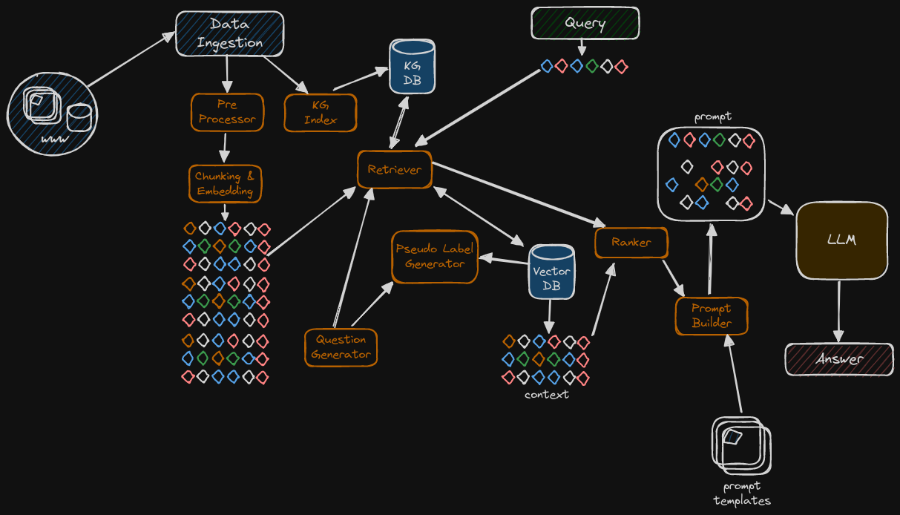

# qRage - Modular framework for building Retrieval Augmented Generation (RAG) pipelines

<p align="center">
    
</p>

## Introduction
This framework provides flexible Retrieval Augmented Generation (RAG) by integrating with frameworks like Haystack and LlamaIndex. It uses parametrized configurations to leverage various transformer and LLM models. Key features include:

- Integration with Weaviate vector database and Nebula graph database.
- Custom retrievers combining Hybrid Search, Embedding Fine-tuning, Generative Pseudo Labelling, and ReRanking techniques.

## Installation
Clone the repository:
```bash
git clone https://github.com/a-romero/qrage.git
cd qrage
```

## 🐳 Starting Weaviate Vector Database
### Standard Setup
1. Navigate to the standard directory:
   ```bash
   cd vectordb/weaviate/standard
   ```
2. Start the Weaviate instance using Docker:
   ```bash
   docker-compose up -d
   ```

### Advanced Setup
1. Navigate to the advanced directory:
   ```bash
   cd vectordb/weaviate/advanced
   ```
2. Start the Weaviate instance using Docker:
   ```bash
   docker-compose up -d
   ```
*Note:* The Weaviate service becomes available locally on http://localhost:8080
## 🐳 Starting Nebula Graph Database
1. Navigate to the standard directory:
   ```bash
   cd graphdb/nebulagraph
   ```
2. Start the Nebula instance using Docker:
   ```bash
   docker-compose up -d
   ```
*Note:* The Nebulagraph service becomes available locally on http://localhost:9669 with the default credentials root/nebula

## Requirements
- OpenAI API key exported to local env variable `OPENAI_API_KEY`
- HuggingFace API key exported to local env variable `HUGGINGFACEHUB_API_TOKEN`
- Cohere API key exported to local env variable `COHERE_API_KEY`

## Usage
### Data sources
The following file formats are supported:
- .text
- .pdf
- .md
- .docx

For data input, the following sources are supported:
- Local file
- Local directory (recursive ingestion)
- HTTP(S)
- S3

### Indexing/Embedding pipeline
The embedding models supported are:
- "sentence-transformer" => "sentence-transformers/multi-qa-mpnet-base-dot-v1"
- (OpenAI) "ada" => "text-embedding-ada-002"
- (Cohere) "embed" => "embed-multilingual-v2.0"

```python
haystack_embed.embed(source="./data", 
                    index_name="test", 
                    recreate_index=True,
                    batch_size=5,
                    model="sentence-transformer",
                    dim=768,
                    gpl=False,
                    language="en"
                    )
```

### Retrieval/Querying pipeline
The generative models supported are:
- (Mistral) "mistral" => "mistralai/Mistral-7B-Instruct-v0.1"
- (TII) "falcon" => "tiiuae/falcon-7b-instruct"
- (OpenAI) "gpt-3.5-turbo"
- (OpenAI) "gpt-4"
- (OpenAI) "gpt-4-turbo" => "gpt-4-1106-preview"
- (Cohere) "command"

#### Using a VectorDB RAG (with Weaviate):
```python
haystack_generate.generateWithVectorDB(query="How would Revolut be impacted by AIG going bankrupt?", 
                    index_name="test",
                    embedding_model="sentence-transformer",
                    dim=768,
                    generative_model="gpt-4",
                    top_k=5,
                    draw_pipeline=False
                    )
```
Response:
```
Retriever:  <haystack.nodes.retriever.dense.EmbeddingRetriever object at 0x7f39f1be1050>
Prompt:  <haystack.nodes.prompt.prompt_node.PromptNode object at 0x7f390e2ce010>
Ranker:  <haystack.nodes.ranker.cohere.CohereRanker object at 0x7f390c3c1dd0>
Batches: 100%|██████████████████████████████████████████████████████████████████████████████████████████████████████████████████████████████████████████████████████████████████████████████████████████| 1/1 [00:00<00:00, 22.21it/s]
Answer:  {'answers': [<Answer {'answer': "If AIG were to go bankrupt, Revolut could be impacted because it sells AIG car insurance. This could result in a loss of an insurance provider and potentially disrupt services for customers who have purchased AIG car insurance through Revolut. It might also impact Revolut's plans for launching mortgage loans.", 'type': 'generative', 'score': None, 'context': None, 'offsets_in_document': None, 'offsets_in_context': None, 'document_ids': ['073d20d7-9223-eac5-9333-54d528bc5a91', '4a723bfc-a5fd-9905-3ec7-c71ffacc2ccb', '26f31a1e-7109-1b8c-c25c-9f5283be1a93', '03aefc09-9643-93c2-4e83-f343006077a9', '67835bb8-e6fb-1c6c-a246-6e74c5f9b9b3'], 'meta': {'prompt': "Given the provided Documents, answer the Query.\n\n                                                Query: How would Revolut be impacted by AIG going bankrupt?\n\n                                                Documents: News • Jul 31, 2023\nRevolut to sell AIG car insurance, may be closer to launching mortgage loans News • Aug 4, 2023\nChannel News Asia — Revolut to stop crypto services for US customers\nNews • Aug 2, 2023\nFintech Singapore — Revolut Launches Instant Card Transfers to Over 80 Countries\nNews • Aug 2, 2023\nCrowdfund Insider — Revolut, Game4Ukraine to Raise Funds for Reconstruction of Ukrainian School\nNumber of Articles\n1,699\nRevolut SAVE\nGo back to Revolut's Signals & News\x0c16/08/2023, 23:44 Revolut - Recent News & Activity\nhttps://www.crunchbase.com/organization/revolut/signals_and_news/timeline 2/9\nNews • Jul 31, 2023\nRTE.ie — Revolut starts phasing in car insurance offering\nNews • Jul 31, 2023\nIrish Examiner — Revolut to sell AIG car insurance, may be closer to launching mortgage loans\nNews • Jul 31, 2023\nThe Independent.ie — ‘30pc cheaper rates’ promised – Revolut car insurance launches in Ireland today\nwith a quote taking just ‘minutes’ on the app\nNews • Jul 25, 2023\nPYMNTS.com — Revolut Extends Accounts in US to Non-Citizens\nNews • Jul 24, 2023\nFinextra — Revolut launches joint accounts in the UK\nNews • Jul 19, 2023\nFStech — Monzo, Revolut and Wise demand ‘urgent review’ of hidden international fees\nNews • Jul 14, 2023\nSifted — Revolut moves closer to super-app status by adding tour and travel experience bookings\nNews • Jul 14, 2023\ntechbuzzireland — Revolut launches marketplace with over 300,000 tours, activities, and attractions\nas it supercharges trips around the world\nNews • Jul 14, 2023\nAltFi — Revolut expands travel offering with in-app marketplace\nNews • Jul 14, 2023\nBusinessCloud — Revolut launches ‘Experiences’ marketplace\nNews
...
```

Using a WebRetriever RAG:
```python
haystack_generate.generateWithWebsite("Write a brief introduction of Revolut's CEO",
                                          domains=["crunchbase.com"],
                                          litm_ranker=True,
                                          max_length=800
```
Response:
```
Prompt:  <haystack.nodes.prompt.prompt_node.PromptNode object at 0x7f3bad9094d0>
  return self.fget.__get__(instance, owner)()
Ranker:  <haystack.nodes.ranker.lost_in_the_middle.LostInTheMiddleRanker object at 0x7f3bad90ba10>
Answer:  {'answers': [<Answer {'answer': 'Nikolay Storonsky is the Founder and Chief Executive Officer (CEO) of Revolut, an innovative financial technology company. Prior to founding Revolut, he served as an Equity Derivatives Trader at Credit Suisse and Lehman Brothers.', 'type': 'generative', 'score': None, 'context': None, 'offsets_in_document': None, 'offsets_in_context': None, 'document_ids': ['f88e3d044dc68bf9d77f6ad8f08f5493'], 'meta': {'prompt': "Given the provided Documents, answer the Query.\n\n                                                Query: Write a brief introduction of Revolut's CEO\n\n                                                Documents: Overview. Nikolay Storonsky is the Founder and CEO at Revolut. He is a former Equity Derivatives Trader at Credit Suisse and Lehman Brothers. Economic School.\n                                                Answer: \n                                            "}}>], 'invocation_context': {'query': "Write a brief introduction of Revolut's CEO", 'documents': [<Document: {'content': 'Overview. Nikolay Storonsky is the Founder and CEO at Revolut. He is a former Equity Derivatives Trader at Credit Suisse and Lehman Brothers. Economic School.', 'content_type': 'text', 'score': None, 'meta': {'url': 'https://www.crunchbase.com/person/nikolay-storonsky', 'timestamp': 1701187258, 'search.score': 0.18181818181818182, 'search.position': 1, 'snippet_text': 'Overview. Nikolay Storonsky is the Founder and CEO at Revolut. He is a former Equity Derivatives Trader at Credit Suisse and Lehman Brothers. Economic School.', '_split_id': 0, 'score': '0.67864573'}, 'id_hash_keys': ['content'], 'embedding': None, 'id': 'f88e3d044dc68bf9d77f6ad8f08f5493'}>], 'answers': [<Answer {'answer': 'Nikolay Storonsky is the Founder and Chief Executive Officer (CEO) of Revolut, an innovative financial technology company. Prior to founding Revolut, he served as an Equity Derivatives Trader at Credit Suisse and Lehman Brothers.', 'type': 'generative', 'score': None, 'context': None, 'offsets_in_document': None, 'offsets_in_context': None, 'document_ids': ['f88e3d044dc68bf9d77f6ad8f08f5493'], 'meta': {'prompt': "Given the provided Documents, answer the Query.\n\n                                                Query: Write a brief introduction of Revolut's CEO\n\n                                                Documents: Overview. Nikolay Storonsky is the Founder and CEO at Revolut. He is a former Equity Derivatives Trader at Credit Suisse and Lehman Brothers. Economic School.\n                                                Answer: \n                                            "}}>], 'prompts': ["Given the provided Documents, answer the Query.\n\n                                                Query: Write a brief introduction of Revolut's CEO\n\n                                                Documents: Overview. Nikolay Storonsky is the Founder and CEO at Revolut. He is a former Equity Derivatives Trader at Credit Suisse and Lehman Brothers. Economic School.\n                                                Answer: \n                                            "]}, 'documents': [<Document: {'content': 'Overview. Nikolay Storonsky is the Founder and CEO at Revolut. He is a former Equity Derivatives Trader at Credit Suisse and Lehman Brothers. Economic School.', 'content_type': 'text', 'score': None, 'meta': {'url': 'https://www.crunchbase.com/person/nikolay-storonsky', 'timestamp': 1701187258, 'search.score': 0.18181818181818182, 'search.position': 1, 'snippet_text': 'Overview. Nikolay Storonsky is the Founder and CEO at Revolut. He is a former Equity Derivatives Trader at Credit Suisse and Lehman Brothers. Economic School.', '_split_id': 0, 'score': '0.67864573'}, 'id_hash_keys': ['content'], 'embedding': None, 'id': 'f88e3d044dc68bf9d77f6ad8f08f5493'}>], 'root_node': 'Query', 'params': {}, 'query': "Write a brief introduction of Revolut's CEO", 'node_id': 'PromptNode'}
/usr/lib/python3.11/tempfile.py:895: ResourceWarning: Implicitly cleaning up <TemporaryDirectory '/tmp/tmp8g9evya6'>
  _warnings.warn(warn_message, ResourceWarning)
```

#### Using a Custom Hybrid Retriever that leverages both VectorDB embeddings and a Knowledge Graph
```python
llamaindex_embed.kg_index(source=path,
                           space_name=index_name
                        )
```
Response:
```
(Revolut, is making money accessible by, driving borderless finance in Latin America)
(Revolut, says Latin America is, key region for growth)
(Revolut, to boost crypto team by, 20% despite US exit)
(Revolut CEO, on growing a multi-currency card into, financial super app)
(Revolut, self-shutters US crypto business as, Coinbase moves to dismiss SEC suit)
(Revolut and Elon Musk's X, can become, everything apps)
(Revolut, to stop crypto services for, US customers)
(Revolut, launches instant card transfers to, over 80 countries)
(Revolut and Game4Ukraine, to raise funds for, reconstruction of Ukrainian school)
(Revolut, starts phasing in, car insurance offering)
(Revolut, sells, AIG car insurance)
(Revolut, may be closer to launching, mortgage loans)
(Revolut, launches, joint accounts in the UK)
(Revolut, demands urgent review of, hidden international fees)
(Revolut, moves closer to super-app status by adding, tour and travel experience bookings)
(Revolut, expands travel offering with, in-app marketplace)
...
```

```python
retrieve_pipeline.get_response_with_VKBRetriever("How would Revolut be impacted by AIG going bankrupt?",
                                                generative_model="gpt-4",
                                                index_name=index_name,
                                                space_name=index_name
                                                )
```
Response:
```
Knowledge Graph index:  <llama_index.indices.knowledge_graph.base.KnowledgeGraphIndex object at 0x7f67d0680550>
WARNING - llama_index.service_context -  chunk_size_limit is deprecated, please specify chunk_size instead
If AIG were to go bankrupt, Revolut could be impacted as it sells AIG car insurance. This could potentially disrupt their insurance services and they might need to find a new insurance provider. However, the specific impact would depend on the details of their agreement with AIG and their contingency plans for such events.
```


### ToDo
- Support for json and csv docs
- Process file metadata and use it with the retriever
- LLM validation
- Structured prompting with Pydantic
- Support for router fine tuning
- Implement chain of thought